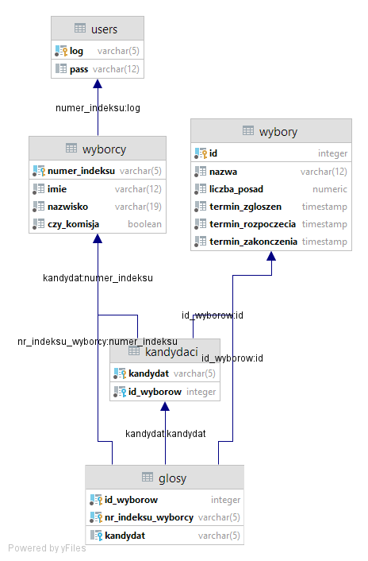

# data-bases-course
<b>Assignments and projects for data bases course<b>

>Wybory do samorządu studenckiego

>Założenia\
Samorząd studencki potrzebuje oprogramowania do obsługi rozmaitych wyborów samorządowych. Oprogramowanie powinno być oparte na bazie danych. Kontakt z użytkownikami może odbywać się przez przeglądarkę WWW (podejście klient/serwer).

>Wyróżnia się dwie kategorie użytkowników:

-komisja wyborcza\
-wyborca.

Wyborcy są studentami, więc można założyć, że posiadają numer indeksu.\
W zasadzie członkiem komisji nie powinien być kandydat, proponuję jednak nie zajmować się tym i przyjąć, że komisja jest to sztuczny użytkownik, który nie jest wyborcą i którego hasło znają tylko upoważnione osoby.

>Wyborca powinien mieć możliwość:

-zgłaszania kandydatów do aktualnych wyborów (jeśli nie minął jeszcze termin ich zgłaszania); kandydat musi być wyborcą\
-głosowania (tylko raz!) na wybranych kandydatów;\
-oglądania wyników wyborów (po ich zakończeniu, nie podczas).

>Do obowiązków komisji wyborczej należy

-rejestrowanie nowych wyborców (w praktyce pewnie pobrano by listę z USOSa);\
-rejestrowanie nowych wyborów: nazwa, liczba posad, termin zgłaszania kandydatów, termin rozpoczęcia i zakończenia głosowania;\
-publikowanie wyników wyborów.  

  Diagram ERD:

